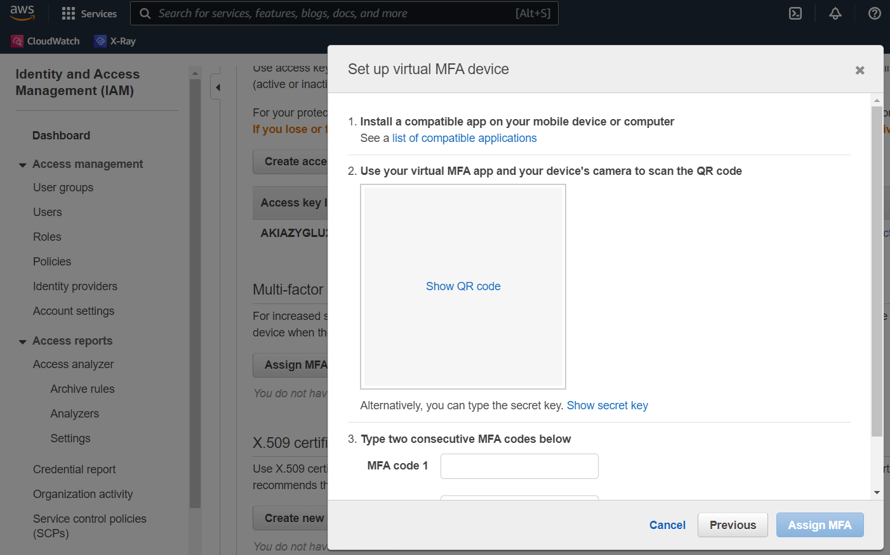

# User's Guide


## Requirements
- [Aws CLI](https://aws.amazon.com/cli/).
- [DotNet 6.0 Runtime](https://dotnet.microsoft.com/download).
- Windows (Currently only Windows is supported, but it should be easy to add support for Mac and Linux).


## Pre-requisites
You need to have already configured AWS credentials file 
with a profile containing the permanent `aws_access_key_id` and `aws_secret_access_key`.
You should get those from [the AWS console](https://console.aws.amazon.com/):  
Click on your user-name on the top right corner > "Security Credentials" > "Access keys for CLI, SDK, & API access" > "Create access key".  
So your `.aws\credentials` file should contain something like this:  
```
[default]
aws_access_key_id = AAAAAAAAAAA123456789
aws_secret_access_key = XXXXXXXXXXXXXXXXXXXXXXXXXXXXXXXXXXXXXXXX
```

## How to use
Open the app, enter the required fields and click on the "Update credentials" button,
this will edit your local AWS credentials file at:  
`C:\Users\%USERNAME%\.aws\credentials`  

Editing the following fields, from the selected profile, with the new values from the command `aws sts get-session-token`:
- `aws_access_key_id`
- `aws_secret_access_key`
- `aws_session_token`


## Setup this App as your MFA-Device

From the AWS-console, assign a device as MFA token generator by going to top right corner menu: 
'Security Credentials' > 'Manage MFA device'.  
You will have to remove any previously assigned device in order to be able to add a new one.  
Insert the 64 alpha-numeric secret key into the `Authenticator secret key` field 
to be able to generate the tokens instead of entering the token manually by reading it from another device/phone.

> Notice AWS doesn't support managing multiple devices, but even so it is still possible to have multiple MFA generators at the same time.
The only catch is that removing the Device as MFA will remove all of them.
See [this request in AWS forum](https://forums.aws.amazon.com/thread.jspa?threadID=137055&start=100&tstart=0).




### Troubleshooting Errors
- `MultiFactorAuthentication failed with invalid MFA one time pass code.`:  
   This shows when the token is invalid or has already expired or already been used once.

- `The parameters: 'awsProfileSource' and 'awsProfileSource' should not be the same because that would override the permanent 'aws_access_key_id'/'aws_secret_access_key' with the temporal one.`:  
   Ensure that "Aws Profile Source" points to a different profile than "Aws Profile To Update".

- `(AccessDenied) when calling the GetSessionToken operation: Cannot call GetSessionToken with session credentials`:  
   This occurs when the "Aws Profile Source" you have selected contains an access key that is not the permanent one from AWS-console, 
   but one generated by MFA as a temporal access key.

- `Partial credentials found in assume-role, missing: source_profile or credential_source`:  
   Check that your `.aws\credentials` file doesn't have extra properties like `role_arn` 
   in the profile you are using as "Aws Profile Source".


### UI Mode
Just running the app will show the UI with a form to fill in all required configuration.  
The configuration is automatically saved in the `AppSettings.json` file when the app closes.


### CMD Console Mode
This app can be used from the command-line, 
if certain command-line parameters are found like the `--Aws:TokenCode` parameter, the app will run in console mode instead of launching the UI.
Example:  
```cmd
AwsCredentialManager.exe --Aws:AccountId 678901234567 --Aws:UserName YOUR_AWS_USER --Aws:ProfileSource default  --Aws:Profile opsmfa --Aws:TokenCode 123456
# Or just:
AwsCredentialManager.exe -A 678901234567 -U YOUR_AWS_USER -S default -P opsmfa -C 123456
```
If the app is already configured in the `AppSettings.json` file, then you only need to specify the `Token` parameter:
```cmd
AwsCredentialManager.exe -Token 123456 
```

> Running in command-line generates a log file named `AwsCredentialManager.log` in the same directory as the app,
> this log is used to debug what the app is doing and to be able to visualize possible error output.

#### CMD: Update AWS credentials
To further automate the AWS credentials update, once the app is configured with the required fields, 
you can run this app from the command-line using the argument parameter `-UpdateCreds` 
and it will automatically update your credentials without firing up the UI and close the app after it finishes.

> You can use this `-UpdateCreds` CMD mode to create a recurrent task in the Task-Scheduler everyday and forget about having to manually manage it.
> Check the [Task-Scheduler exported example](../scripts/TaskScheduler/LazaroOnline-AwsCredentialManager-UpdateCreds.xml).


#### CMD: Copy token
In cases like login to the AWS web console, you want to generate a token and copy it to the AWS web.  
To speedup this flow, you can run the app with the CMD argument parameter `--CopyToken` 
and it will automatically generate and copy the token to the clipboard and then close the app instantly.


## Configuration
The configuration is stored in a file named `AppSettings.json` placed next to the application.  

 Config parameter            | Short Name | Description
-----------------------------|------------|---------------------------------------------------------------------------------
 Aws > AccountId             |    -A      | 12 digit number of the AWS project account.
 Aws > UserName              |    -U      | Personal AWS user name, usually your email.
 Aws > ProfileSource         |    -S      | AWS profile name that already contains the access keys. It should already exist in your `.aws\credentials` file.
 Aws > Profile               |    -P      | AWS profile name where the temp credentials will be added. If it doesn't exist it will be auto-generated.
 Aws > Token                 | -T or -C   | MFA personal user token (one time token).
 Aws > MfaGeneratorSecretKey |    -M      | MFA generator secret key used when configuring.

